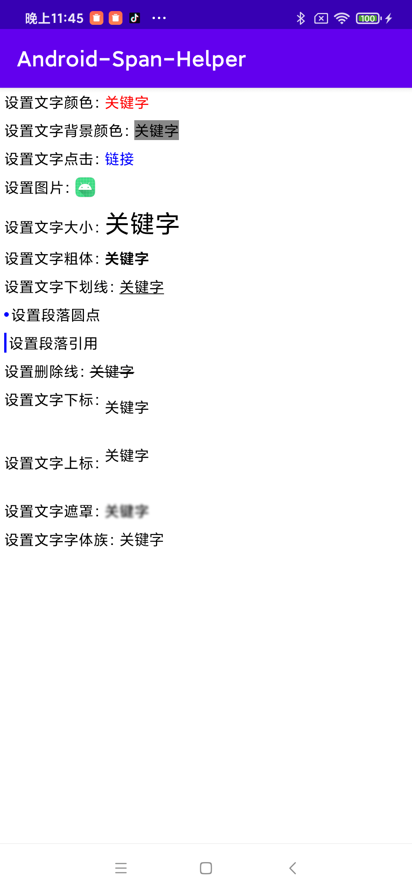

# Android-Span-Helper

Android轻量级Span框架，目前支持以下文本效果：


### 使用方式。

[下载地址](https://github.com/zrheasy/Android-Span-Helper/releases/download/v1.0.0/span-helper.aar)

#### 1.设置文字颜色。

```kotlin
SpanHelper(source)
    .setColor(keyword, Color.RED)
    .into(mBinding.tvColor)
```

#### 2.设置文字背景颜色。

```kotlin
SpanHelper(source)
    .setBackgroundColor(keyword, Color.GRAY)
    .into(mBinding.tvBackgroundColor)
```

#### 3.设置文字点击。

```kotlin
SpanHelper(source)
    .setClick(keyword) {
        toast("Hello world!")
    }
    .into(mBinding.tvClick)
```

#### 4.设置图片。

```kotlin
SpanHelper(source)
    .setImage(keyword, drawable(R.mipmap.ic_launcher_round), dp2Px(20), dp2Px(20))
    .into(mBinding.tvImage)
```

#### 5.设置文字大小。

```kotlin
SpanHelper(source)
    .setSize(keyword, sp2Px(24))
    .into(mBinding.tvSize)
```

#### 6.设置文字粗体。

```kotlin
SpanHelper(source)
    .setBold(keyword)
    .into(mBinding.tvBold)
```

#### 7.设置文字下划线。

```kotlin
SpanHelper(source)
    .setUnderline(keyword)
    .into(mBinding.tvUnderline)
```

#### 8.设置段落圆点。

```kotlin
SpanHelper(source)
    .setBullet(dp2Px(2), Color.BLUE, dp2Px(2))
    .into(mBinding.tvBullet)
```

#### 9.设置段落引用。

```kotlin
SpanHelper(source)
    .setQuote(dp2Px(2), Color.BLUE, dp2Px(2))
    .into(mBinding.tvQuote)
```

#### 10.设置删除线。

```kotlin
SpanHelper(source)
    .setStrikethrough(keyword)
    .into(mBinding.tvStrikethrough)
```

#### 11.设置文字下标。

```kotlin
SpanHelper(source)
    .setSubscript(keyword)
    .into(mBinding.tvSubscript)
```

#### 12.设置文字上标。

```kotlin
SpanHelper(source)
    .setSuperscript(keyword)
    .into(mBinding.tvSuperscript)
```

#### 13.设置文字遮罩。

```kotlin
SpanHelper(source)
    .setMaskFilter(keyword, BlurMaskFilter(5f, BlurMaskFilter.Blur.NORMAL))
    .into(mBinding.tvMask)
```

#### 14.设置字体族。

```kotlin
SpanHelper(source)
    .setTypeface(keyword, Typeface.MONOSPACE)
    .into(mBinding.tvTypeface)
```
